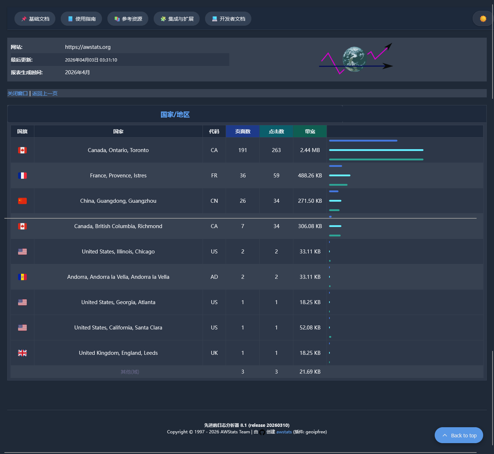

# AWStats 8.1 - Outil avancé de statistiques web (Édition Communautaire)

<p align="center">
  
</p>

<p align="center">
  <a href="https://www.gnu.org/licenses/gpl-3.0.html#license-text"></a>
  <a href="https://www.perl.org/"></a>
  <br><br>
  <a href="https://github.com/hestiacn/vstats/releases/latest"></a>
  <br><br>
  <a href="docs/CHANGELOG-zh_CN.md"></a>
  <br><br>
  <a href="docs/CHANGELOG.md"></a>
</p>

> **🎉 C'est la première version majeure communautaire de vstats !** Une refonte complète du légendaire `AWStats` (1997-2025). Nous l'avons dépoussiéré pour le rendre apte à relever les défis des 25 prochaines années !

L'`AWStats` original a été archivé en novembre 2025 après 25 ans de maintenance. Ce projet est une refonte complète et une amélioration fonctionnelle de l'original, maintenue par la communauté [hestiacn](https://github.com/hestiacn/vstats).

---

## 🚀 Points forts de la version

### 1. Support UTF-8 natif (adieu les problèmes d'encodage)

Fini les problèmes d'encodage ! Toute la logique interne et la sortie utilisent désormais pleinement l'encodage UTF-8. Les caractères chinois, japonais, arabes et autres caractères spéciaux s'affichent désormais parfaitement.

### 2. Localisation « pleine d'âme » (73 langues)

- Migration de l'ensemble du système de traduction d'index numériques vers des clés sémantiques (`_t('key')`)
- Ajout/mise à jour de 73 langues (dont le chypriote, le portugais brésilien, etc.)
- Ajout de descriptions d'humour uniques pour les statistiques horaires sur 24 heures - une petite surprise pour les administrateurs système qui travaillent à 4h du matin ! ☕️

### 3. Interface utilisateur moderne et responsive

- **Mode sombre/clair** : basculement en un clic
- **Graphiques CSS pur** : les anciennes images PNG ont été remplacées par des graphiques CSS modernes supportant `border-radius`
- **Intégration d'émojis** : utilisation d'émojis pour la visualisation des données, offrant une expérience visuelle moderne

### 4. Optimisations des performances et du code

- Nettoyage majeur du code Perl pour de meilleures performances dans les environnements CGI modernes
- Détection améliorée des navigateurs et robots modernes (règles 2026)

### 5. Support multi-calendriers et 13 mois 🗓️

Support de **13 types de calendriers** (dont les calendriers éthiopien et hébraïque avec **13 mois**), avec correspondance automatique à la langue du site.

> 📌 **Calendrier éthiopien** : Les 12 premiers mois ont 30 jours chacun, le 13ème mois a 6 jours (année bissextile) ou 5 jours (année commune).
> 📌 **Calendrier hébraïque** : 7 années bissextiles sur 19 ans, ajout d'Adar I (30 jours) les années bissextiles, formant un 13ème mois.

### 6. Affichage de marque personnalisé 🏷️

> **Pour les hébergeurs et les entreprises**

Possibilité d'afficher des informations de marque personnalisées (**logo** et **nom de marque**) en haut de la page `AWStats`.

**Fonctionnalités** :
- 📍 La zone de marque s'affiche automatiquement uniquement si le fichier `/stats/logo.svg` existe
- 🔗 Support de lien personnalisé (clic sur le logo)
- 🏷️ Support de noms de marque arbitraires (recommandé en anglais pour compatibilité multilingue), formaté automatiquement en **`Nom de la marque + " Panneau d'administration serveur"`**

**Exemples d'utilisation** :
| Type | Exemples |
|:---:|:---:|
| 🐧 Distributions Linux | `RHEL`, `Debian`, `Ubuntu`, `CentOS`, `Arch Linux`, `Fedora`, `Rocky Linux` |
| 🖥️ Systèmes d'exploitation | `macOS`, `Windows`, `FreeBSD` |
| ☁️ Hébergeurs cloud | `Aliyun`, `Tencent`, `AWS`, `Azure`, `Google Cloud` |

**Exemple de configuration** :
```perl
# À ajouter dans le fichier de configuration AWStats
BrandLink="https://example.com"      # Lien de clic du logo
BrandPlatform="Ubuntu"               # Nom de la marque (affiche "Ubuntu Panneau d'administration serveur")
StatsUrl="/vstats"                   # Répertoire de déploiement AWStats
```

> **Note** : La zone de marque s'affiche uniquement si le fichier `logo.svg` existe. Si `BrandLink` n'est pas configuré, la valeur par défaut `https://hestiacp.com` sera utilisée.

---

## 📦 Téléchargement et installation

Téléchargez la dernière version depuis les liens ci-dessous :

| Système/Format | Lien de téléchargement |
|:---:|:---:|
| **Debian/Ubuntu** | [](https://github.com/hestiacn/vstats/releases/latest/download/awstats_8.1-1_all.deb) |
| **RHEL/CentOS/Fedora** | [](https://github.com/hestiacn/vstats/releases/latest/download/awstats-8.1-1.noarch.rpm) |
| **Code source (tar.gz)** | [](https://github.com/hestiacn/vstats/releases/latest/download/awstats-8.1.tar.gz) |
| **Code source (zip)** | [](https://github.com/hestiacn/vstats/releases/latest/download/awstats-8.1.zip) |
| **Windows** | [](https://github.com/hestiacn/vstats/releases/latest/download/awstats-8.1-utf8.exe) |

> **Note pour l'environnement Windows** : La version Windows n'inclut que l'installateur EXE, la structure des répertoires et les chemins n'ont pas été testés. Si vous rencontrez des problèmes, n'hésitez pas à ouvrir une Issue ou une Pull Request !

---

## 📊 Comparaison avec la version originale

| Fonctionnalité | AWStats Original | Version Refondue |
|:---:|:---:|:---:|
| Encodage | GBK / encodage partiel | **Support UTF-8 complet** |
| Système de traduction | Index numérique `$Message[169]` | **Clés sémantiques `_t('key')`** |
| Interface | Style fixe | **Thèmes clair/sombre + responsive** |
| Drapeaux | Images PNG | **Émojis** |
| Graphiques | Images PNG | **Graphiques CSS pur** |
| Support calendrier | Grégorien | **13 calendriers** |
| État de maintenance | Archivé | **Maintenance continue** |

---

## ✨ Liste complète des fonctionnalités

| Catégorie | Fonctionnalité |
|:---:|:---:|
| 🌐 Accès CGI multilingue | Interface en `73` langues, détection automatique par le navigateur. Permet aux visiteurs du monde entier de voir les rapports dans leur langue maternelle ! [Voir la liste complète des langues supportées](docs/CHANGELOG.md#-language-support) |
| 🗓️ Support multi-calendriers | **13 types de calendriers** (dont calendrier éthiopien à 13 mois), correspondance automatique avec la langue du site |
| 📊 Statistiques d'accès | Visiteurs uniques, nombre de visites, durée des visites, suivi des utilisateurs authentifiés |
| 🌍 Géolocalisation | Base de données gratuite `DB-IP`, localisation pays/région/ville, support IPv4/IPv6 |
| 💻 Informations client | Navigateur, système d'exploitation, résolution d'écran, type d'appareil (ordinateur/mobile) |
| 🤖 Identification des robots | `500+` robots de moteurs de recherche, robots IA/ML (ClaudeBot, GPTBot, etc.) |
| 📁 Statistiques fichiers | Types de fichiers, téléchargements (reprise), compression (mod_gzip/mod_deflate) |
| ⚠️ Analyse d'erreurs | Erreurs `HTTP` (404, etc.), source des erreurs, codes d'état de détection d'attaques de vers localisés |
| 🎨 Interface moderne | Design responsive, thèmes clair/sombre, graphiques CSS pur, émojis pour les drapeaux |

---

## 📋 Prérequis système

### Prérequis de base
- ✅ Accès aux fichiers journaux du serveur à analyser (Web/FTP/Mail)
- ✅ 5.20 ou supérieur (5.32+ recommandé)
- ✅ Environnement ligne de commande et/ou CGI

### Systèmes d'exploitation supportés
- 🐧 Linux/Unix (Ubuntu, Debian, CentOS, RHEL, etc.)
- 🪟 Windows (Windows 10/11, Windows Server)
- 🍎 macOS
- 🔵 FreeBSD, OpenBSD

### Serveurs supportés
- 🌐 Web : Apache, Nginx, IIS, Caddy, Lighttpd
- 📁 FTP : ProFTPd, vsFTPd, Pure-FTPd
- 📧 Email : Postfix, Sendmail, QMail, Exim
- 🎥 Streaming : RealMedia, Windows Media Server

---

## **Correction de compatibilité AWStats Geo/IPfree.pm**

Si vous rencontrez l'erreur suivante lors de la mise à jour d'AWStats :
```
Error: Perl v5.200.0 required (did you mean v5.20.0?)--this is only v5.36.0
```

C'est parce que la vérification de version dans le fichier `Geo/IPfree.pm` n'est pas compatible avec la version Perl actuelle du système.

### **Commande de correction automatique**
```bash
find /usr -name "IPfree.pm" 2>/dev/null | while read -r file; do
    sed -i.bak 's/^use 5\.20;/#use 5.20;/' "$file"
done
```

### **Étapes de correction manuelle**
Si la commande automatique ne fonctionne pas, veuillez suivre les étapes suivantes :

1. **Rechercher l'emplacement du fichier**
   ```bash
   find /usr -name "IPfree.pm" 2>/dev/null
   ```

2. **Modifier le fichier et commenter la ligne de vérification de version**
   ```bash
   sed -i 's/^use 5\.20;/#use 5.20;/' /path/to/IPfree.pm
   ```

### **Fichiers supplémentaires (si nécessaire)**
En raison de la diversité et de la complexité des plateformes, différents systèmes peuvent utiliser différentes versions. Si les fichiers correspondants ne sont pas présents sur votre système, veuillez les remplacer manuellement par les fichiers suivants :

| Fichier | Emplacement |
|------|------|
| `/usr/share/perl5/Geo/IPfree.pm` | [IPfree.pm](/wwwroot/cgi-bin/lib/IPfree.pm) |
| `/usr/share/perl5/Geo/IPfree.pod` | [IPfree.pod](/wwwroot/cgi-bin/lib/IPfree.pod) |
| `/usr/share/perl5/Geo/dbip-city.mmdb` | [update-dbip](/make/test/awstats/conf/update-dbip) |

---

## 🔄 Conversion avant mise à niveau (uniquement pour les mises à niveau depuis une version plus ancienne)

Lors d'une mise à niveau de site, exécutez d'abord `/usr/share/awstats/tools/awstats_convert-en.pl` pour convertir le format des fichiers de données historiques (*.txt) (7.0-7.9 → 8.1). Le programme détectera et convertira automatiquement tous les fichiers de données `AWStats` (*.txt) dans `/home/*/web/*/stats/`. Il sauvegardera automatiquement les fichiers originaux avant la conversion. Si votre site n'est pas dans le répertoire `home`, adaptez-vous à cette structure de chemin : `/home/nom_d'utilisateur_du_site/web/votre_domaine/stats/`. Après la conversion, exécutez la mise à jour des données, sinon la mise à jour échouera en raison d'incompatibilité de format.

> **Note** : Si la version de votre site est antérieure à 7.0, ajustez le paramètre de correspondance de l'expression régulière `s/AWSTATS DATA FILE 7\.[0-9]{1,2}/AWSTATS DATA FILE 8.1/` en fonction du numéro de version réel.
>
> **💡 Astuce** : Les fichiers de sauvegarde sont stockés dans `/backup/awstats_converter/backup_[horodatage]/` par défaut.

```bash
# Test (affiche les fichiers qui seront convertis)
perl /usr/share/awstats/tools/awstats_convert-en.pl --dryrun

# Exécution normale
perl /usr/share/awstats/tools/awstats_convert-en.pl

# Forcer la reconversion de tous les fichiers
perl /usr/share/awstats/tools/awstats_convert-en.pl --force

# Mode silencieux
perl /usr/share/awstats/tools/awstats_convert-en.pl --quiet

# Afficher l'aide
perl /usr/share/awstats/tools/awstats_convert-en.pl --help
```

---

## 🚀 Démarrage rapide

### 1. Installation

#### Utilisateurs de HestiaCP (recommandé)

> **Remarque** : Ce script est uniquement adapté au panneau de contrôle HestiaCP. Si vous utilisez un autre panneau de contrôle ou aucun panneau, veuillez vous référer à la fonction `build_awstats()` dans le script et ajuster en fonction de votre environnement réel.

HestiaCP intègre déjà AWStats, il suffit de mettre à jour et d'installer les paquets `deb` et `rpm` pré-compilés pour découvrir la nouvelle version communautaire.

**Distributions supportées** :
- Support officiel : [Debian/Ubuntu](https://github.com/hestiacp/hestiacp)
- Support communautaire : [RHEL/CentOS/Alma/Rocky](https://github.com/bayrepo/hestiacp-rpm)

**Fichiers à ajuster manuellement** :

| Type de fichier | Chemin | Exemple de référence |
|:---:|:---:|:---:|
| Fichier template | `/usr/local/hestia/data/templates/web/awstats/awstats.tpl` | [awstats.tpl](/make/test/awstats/conf/awstats.tpl) |
| Répertoire de configuration des domaines | `/etc/awstats/` | - |
| Script de mise à jour (Debian/Ubuntu et dérivés) | `/usr/local/hestia/bin/v-update-web-domain-stat` | [v-update-web-domain-stat.debian](/make/test/awstats/conf/v-update-web-domain-stat) |
| Script de mise à jour (RHEL/CentOS/Rocky/Alma/Fedora) | `/usr/local/hestia/bin/v-update-web-domain-stat` | [v-update-web-domain-stat.rhel](/make/test/awstats/conf/v-update-web-domain-stat) |

> 📌 **Explication** : Les codes des scripts pour Debian et RHEL sont différents, veuillez choisir l'exemple de référence correspondant à votre système d'exploitation.

> 💡 **Astuce** : Après avoir modifié le script, si vous rencontrez un problème de permission, exécutez `chmod +x /usr/local/hestia/bin/v-update-web-domain-stat`

## Téléchargement et installation

### Intégration avec HestiaCP

> ⚠️ **Remarque importante** : Lors de l'installation dans l'environnement HestiaCP, si le système vous demande de mettre à jour le fichier de configuration, veuillez choisir **`N`** (conserver la configuration d'origine), sinon la configuration de routage spécifique au panneau HestiaCP sera écrasée.

```bash
wget -P /tmp/ https://github.com/hestiacn/vstats/releases/latest/download/awstats_8.1-1_all.deb && apt install -y /tmp/awstats_8.1-1_all.deb
```

### Debian / Ubuntu Installation native

```bash
wget -P /tmp/ https://github.com/hestiacn/vstats/releases/latest/download/awstats_8.1-1_all.deb && apt install -y /tmp/awstats_8.1-1_all.deb
```

### RHEL / CentOS / Rocky Linux / Fedora

```bash
# Utilisation de la commande DNF standard, parfaitement compatible avec tout l'écosystème Red Hat
wget -P /tmp/ https://github.com/hestiacn/vstats/releases/latest/download/awstats-8.1-1.noarch.rpm && dnf install -y /tmp/awstats-8.1-1.noarch.rpm
```

### FreeBSD

```bash
# Verrouillage de protection après installation, élimine complètement les faux rapports de déclassement des versions anciennes des panneaux tiers (comme Webmin)
fetch -o /tmp/awstats-8.1-1.pkg https://github.com/hestiacn/vstats/releases/latest/download/awstats-8.1-1.pkg && \
pkg install -y /tmp/awstats-8.1-1.pkg && \
pkg lock -y awstats
```

### Configuration de base

Éditez le fichier de configuration `/etc/awstats/awstats.votredomaine.conf` :

```perl
LogFile="/var/log/apache2/domains/votredomaine.log"  # Chemin du fichier journal
LogFormat=1                                         # Utiliser le format journal combiné
SiteDomain="votredomaine.com"                       # Domaine du site
HostAliases="localhost 127.0.0.1"                   # Alias d'hôtes
```

### Mise à jour des statistiques

```bash
awstats.pl -config=votredomaine -update
```

### Affichage du rapport

- **Environnement HestiaCP** : Accédez à `https://votredomaine.com/vstats/`. Si vous souhaitez enregistrer un signet, définissez ce répertoire. L'accès charge automatiquement le mode CGI !
- **Génération manuelle d'un rapport statique** : `awstats.pl -config=votredomaine -output > rapport.html`

---

## 📖 Aide en ligne de commande

### Afficher l'aide dans votre langue maternelle

```bash
# Français
dnf install -y glibc-langpack-fr
localectl set-locale LANG=fr_FR.UTF-8
# Pour RHEL/CentOS/Fedora :
source /etc/locale.conf
# Pour Debian/Ubuntu :
source /etc/default/locale
awstats -h

# English (US)
dnf install -y glibc-langpack-en
localectl set-locale LANG=en_US.UTF-8
# For RHEL/CentOS/Fedora:
source /etc/locale.conf
# For Debian/Ubuntu:
source /etc/default/locale
awstats -h

# 日本語
dnf install -y glibc-langpack-ja
localectl set-locale LANG=ja_JP.UTF-8
# RHEL では以下のコマンドを使用
source /etc/locale.conf
# Debian では以下のコマンドを使用
source /etc/default/locale
awstats -h

# 简体中文
dnf install -y glibc-langpack-zh wget
localectl set-locale LANG=zh_CN.UTF-8
# RHEL 使用以下命令
source /etc/locale.conf
# Debian 请使用以下命令
source /etc/default/locale
awstats -h

# English (UK)
dnf install -y glibc-langpack-en 
localectl set-locale LANG=en_GB.UTF-8
# For RHEL/CentOS/Fedora:
source /etc/locale.conf
# For Debian/Ubuntu:
source /etc/default/locale
awstats -h

# Português (Brasil)
dnf install -y glibc-langpack-pt
localectl set-locale LANG=pt_BR.UTF-8
# Para RHEL/CentOS/Fedora:
source /etc/locale.conf
# Para Debian/Ubuntu:
source /etc/default/locale
awstats -h
```

### Commandes courantes

| Commande | Description |
|:---:|:---:|
| `awstats.pl -config=xxx -update` | Mettre à jour les statistiques |
| `awstats.pl -config=xxx -output > rapport.html` | Générer un rapport statique |
| `awstats.pl -config=xxx -update -debug=2` | Mode débogage (nécessite de modifier DebugMessages=1 dans la configuration) |
| `awstats -h` | Afficher l'aide |
| `awstats -v` | Afficher la version |

---

## 📚 Documentation

| Documentation | Lien |
|:---:|:---:|
| Journal des modifications (français) | [docs/CHANGELOG-fr.md](docs/CHANGELOG-fr.md) |
| Journal des modifications (anglais) | [docs/CHANGELOG.md](docs/CHANGELOG.md) |
| Guide d'installation | [docs/awstats_setup.html](docs/awstats_setup.html) |
| Explication de la configuration | [docs/awstats_config.html](docs/awstats_config.html) |
| Foire aux questions | [docs/awstats_faq.html](docs/awstats_faq.html) |

---

## 🤝 Contributions et retours

- **Dépôt du projet** : [GitHub - hestiacn/vstats](https://github.com/hestiacn/vstats)
- **Signalement de problèmes** : [GitHub Issues](https://github.com/hestiacn/vstats/issues)

---

## 💖 Remerciements

Un merci particulier à tous les traducteurs et testeurs qui ont contribué à la traduction correcte des six formes plurielles du gallois et de l'arabe. Vous êtes de véritables héros d'Internet !

---

## 📄 Licence

`AWStats` est un logiciel open source distribué sous [GNU General Public License v3](https://www.gnu.org/licenses/gpl-3.0.html#license-text).

---

## 👨‍💻 À propos de l'auteur et de la maintenance

**Auteur original** : Laurent Destailleur (1997-2025)
- Fondateur du projet, a annoncé l'arrêt des mises à jour en novembre 2025.
- Responsable du projet [Dolibarr ERP CRM](https://www.dolibarr.org)

**Maintenance communautaire** : [hestiacn](https://github.com/hestiacn/vstats)
- Refonte modernisée de la version 8.1
- Maintenance et mises à jour continues

---

## 🔗 Liens connexes

- Site web du projet original : [https://www.awstats.org](https://www.awstats.org)
- Dépôt GitHub du projet original : [eldy/AWStats](https://github.com/eldy/AWStats)
- Base de données DB-IP : [https://db-ip.com](https://db-ip.com)

---

## © 1997-2026 Équipe AWStats | L'édition communautaire est activement maintenue